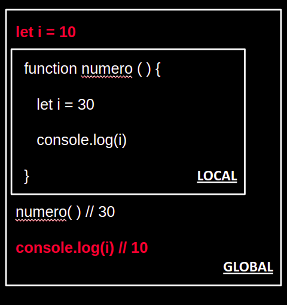

##### Ejemplo 2
## let / const - Contextos

### OBJETIVO

### DESARROLLO
1. `let/const` contienen un concepto llamado `block scope`. Es decir, cuando encierras una variable entre dos llaves ´{}`, sólo funcionará dentro de las mismas llaves. Si creas una variable afuera de la misma, significará otra variable con otro dato.

2. Observa cómo generamos dos variables. Una dentro de una función (la cual comprende dos llaves dentro de su ejecución) y una variable afuera de la función. Ambos significan diferentes datos.

```javascript
function numero ( ) {
   let i = 30
   console.log(i)
}
numero ( )   // 30
```

```javascript
let i = 10
function numero ( ) {
   let i = 30
   console.log(i)
}
numero( ) // 30
console.log(i) // 10 
```


